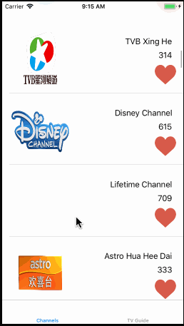

# Astro assignment - *Astro Reduce*
An interview assignment provided by Astro

**Astro Reduce** is a basic app related to media, lifestyle and e-Commerce space [Astro](http://www.astro.com.my/). Implemented by using VIPER architecture.

Time spent: **8** hours spent in total

## User Stories

**Level 1**

- [x] To display a list of Astro channels (showing at a minimum channel name and number)
  - [ ] Ability to sort by channel number
  - [ ] Ability to sort by channel name

- [ ] To allow a user to mark a favourite channel as on-device persistent.
  - [ ] User launches app and tags a favourite channel
  - [ ] User closes app and favourite channel appears in main screen identified as a favourite

**Level 2**

- [x] To display a 'TV Guide' in a display grid (eg http://whatson.astro.com.my/tv-guide)
- [ ] Display the current show for all channels currently airing current time
    - [ ] Sort by channel number or channel name is a must
    - [ ] Pagination is allowed
    - [ ] ‘Lazy loading’ is encouraged
- [ ] Display must be responsive to device timezone

**Level 3**

- [ ] On attempt by user to mark a favourite channel  
  - [ ] Will prompt user for login to a common SSO (Google / FB)
  - [ ] Sorting order will include ‘favourites’ (along with channel number or
channel name)
  - [ ] Favourites and sorting order are to be securely CRUD in a cloud based service (eg. Any AWS method of storage EC2, RDS, S3)
  - [ ] On logout, all information such as sorting order or favourite must be cleared from app.
  
  
## Video Walkthrough

Here's a walkthrough of implemented user stories:

GIF created with [LiceCap](http://www.cockos.com/licecap/).

## Notes

Describe any challenges encountered while building the app.

1. The Astro api is turned off during my implementation.

## License

Copyright [2017] [Tri Ngo Minh]

Licensed under the Apache License, Version 2.0 (the "License");
you may not use this file except in compliance with the License.
You may obtain a copy of the License at

http://www.apache.org/licenses/LICENSE-2.0

Unless required by applicable law or agreed to in writing, software
distributed under the License is distributed on an "AS IS" BASIS,
WITHOUT WARRANTIES OR CONDITIONS OF ANY KIND, either express or implied.
See the License for the specific language governing permissions and
limitations under the License.